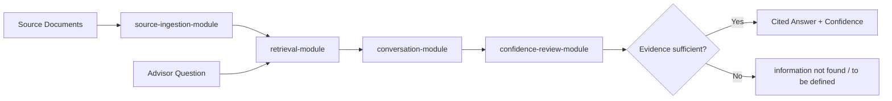

# PolicyBuddies Application Architecture Principles

## Document Control
- Product: Project Buddies (PolicyBuddies)
- Purpose: Define modular application principles before implementation
- Status: Draft for alignment
- Last updated: 2026-02-21

## Changelog
- 2026-02-21: Added LLM-first routing taxonomy and deterministic fallback policy.
- 2026-02-21: Added ingestion/retrieval learnings (PDF table handling, chunking, formula-aware retrieval, dual synthesis mode).
- 2026-02-21: Added agentic loop guardrails (max turns, timeout, no-progress stop rules, termination reason codes).
- 2026-02-21: Added insurance-standard intent routing principle for rider/benefit/exclusion/claims/surrender/premium queries.
- 2026-02-21: Added product-agnostic formula routing principle with ambiguity guard and runtime mapping.
- 2026-02-21: Added rider metadata extraction and deterministic rider-answer principle.
- 2026-02-21: Added intent debug/observability principle for routed flags and planner diagnostics.
- 2026-02-21: Added typo-tolerant intent routing scaffold (normalizer, lexicon, fuzzy matching, merger, routing modes).

## 1. Modular MVP Design

### 1.0 Documentation Governance Principle
- Architecture documents must contain principle-level design content only.
- Architecture documents must not include implementation-coupled details such as:
  - current implementation snapshots,
  - concrete source file/folder scaffolds,
  - MVP rollout task lists,
  - runtime config key names and parameter defaults.
- Implementation details must be documented in `docs/implementation/`.
- Session progress and daily activity logs must be documented in `docs/session-notes/`.

### 1.1 Design Principle
- The application must be modular and allow independent LLM selection per module/function.
- No module may hard-code a dependency on the same provider/model used by another module.
- Each LLM-using module must be replaceable without changing other modules.
- Initial LLM responsibilities:
  - `Ingestion LLM`: extraction/normalization during document onboarding.
  - `Conversation LLM`: advisor Q&A response generation.
  - `Confidence Review LLM`: independent reviewer scoring factual confidence and citation sufficiency.

### 1.2 Module Boundaries
- `source-ingestion-module`: reads sources, normalizes text, attaches metadata.
- `query-planner-module`: classifies question intent and selects retrieval/simulation strategy.
- `retrieval-module`: deterministic chunk retrieval with filters.
- `conversation-module`: generates cited answers only from retrieved evidence.
- `confidence-review-module`: evaluates answer support quality and confidence level.
- `comparison-module`: produces side-by-side product comparison outputs.
- `orchestration-module`: coordinates flow and fallback rules.

### 1.3 LLM Provider Contracts
- `ingestionProvider`: `extractStructuredContent(input) -> normalizedDocument`
- `conversationProvider`: `generateCitedAnswer(question, evidence) -> answerWithCitations`
- `reviewProvider`: `reviewAnswer(answer, evidence) -> {confidence, gaps, status}`
- Each provider is pluggable via registry/config and can point to different model vendors.
- Provider selection must be module-scoped (not global-only), so one module can switch provider/model without side effects on others.

### 1.4 Module Independence Rules for LLM Usage
- Each module consumes only its own provider interface (dependency injection), never another module's provider directly.
- Provider configs are isolated by module key (for example: `ingestion`, `conversation`, `review`).
- Fallback/retry policy is defined per module (timeouts, max retries, failure behavior).
- A failure or provider switch in one module must not require code changes in other modules.
- Modules that are deterministic by design (for example retrieval filtering) must not be forced to use any LLM.

### 1.5 Confidence Review as Agentic AI
- `confidence-review-module` is an agentic reviewer, not a passive scorer.
- It must automatically inspect the conversation output against retrieved source evidence before any answer is returned.
- It must produce:
  - confidence level (for example numeric score and/or band),
  - support status (`sufficient` or `insufficient`),
  - explicit gaps when claims are not well supported by available sources.
- Confidence must be based only on available source evidence and citation quality, not unsupported model inference.

### 1.6 High-Level Interaction Flow

### 1.7 Deterministic and Factual Guardrails
- Conversation output must cite source chunks for each material claim.
- Confidence review runs on every response before returning to advisor.
- If review status is insufficient or evidence is missing, system returns:
  - `information not found`, or
  - `to be defined`.

### 1.11 LLM-First Query Planning and Routing
- Query planning should run as an LLM-first classification step with deterministic fallback.
- Classification taxonomy:
  - `structured_lookup`
  - `calculation`
  - `explanatory`
  - `comparison`
  - `definition`
- Routing policy by class:
  - `structured_lookup` -> retrieval-first with strict source/chunk filters.
  - `calculation` -> formula/simulation engine first; retrieval only for missing variables or citations.
  - `explanatory` -> broader retrieval + LLM synthesis.
  - `comparison` -> multi-document retrieval + comparison formatter.
  - `definition` -> concise definition flow from summary documents.
- Planner output contract must include:
  - intent class and confidence,
  - preferred document and chunk priorities,
  - retrieval depth guidance,
  - fallback tier decision.
- Guardrail:
  - if planner confidence is low, ask one clarifying question before full retrieval.
  - if LLM planner fails, fallback to deterministic policy/rule planner.

### 1.12 Insurance-Standard Intent Routing (Latest)
- Intent routing policy must be insurance-aware, not generic QA-only.
- Minimum insurance intent coverage for MVP:
  - rider benefits and rider coverage,
  - benefit definitions (`death benefit`, `sum assured`, `coverage term`),
  - exclusions and waiting period,
  - claims-related lookup,
  - surrender/cash/policy value lookup,
  - premium and paid-to-date lookup,
  - formula/simulation (`calculate`, `project`, `simulate`, illustrated rates).
- Routing policy must bind each intent to:
  - preferred document types,
  - preferred chunk kinds,
  - topK retrieval target.
- Deterministic rule routing remains mandatory fallback when LLM router/planner fails.

### 1.13 Product-Agnostic Formula Routing
- Formula execution must not be pinned to one product key.
- Formula selection must resolve dynamically from:
  - question product mention,
  - retrieved evidence product metadata,
  - optional default routing key when unambiguous.
- Product-to-formula mapping must be runtime-configurable via routing config file.
- Ambiguity guard:
  - if multiple product mappings match a formula question, system must ask user to specify product and must not guess.

### 1.14 Rider Metadata and Deterministic Rider Answers
- Ingestion must extract rider metadata as structured attributes, at minimum:
  - `riderName`,
  - `benefitType`,
  - `coverageTriggers`,
  - `coverageTerm`,
  - `hasSurrenderValue`,
  - `premiumRateGuarantee`,
  - `benefitSummary`.
- Retrieval must emit rider metadata chunks so rider queries can be answered from structured evidence.
- Conversation synthesis must prefer deterministic rider-answer templates for rider intent.
- Speculative wording (for example `may`, `appears`) is disallowed when evidence is insufficient; return `information not found` instead.

### 1.15 Intent Debug and Explainability
- Ask flow must expose intent diagnostics for every query.
- Minimum debug output:
  - routed intent flags and scope,
  - route confidence and route source,
  - planner class, planner source, planner confidence,
  - planner preferences (document priority, chunk priority, retrieval depth, strictness mode).
- Intent debug output is for operator observability and regression testing, and must not alter answer semantics.

### 1.16 Typo-Tolerant Intent Architecture
- Intent routing must be typo-tolerant for common insurance query errors.
- Routing should use layered signals:
  - query normalization,
  - insurance lexicon matching (synonyms/aliases/common misspellings),
  - fuzzy token matching with bounded edit distance,
  - LLM intent classification,
  - deterministic fallback policy.
- Merge policy must preserve safety-critical intent flags when LLM misses or under-classifies.
- Typo correction must not alter numeric or financially sensitive literals.
- Full scaffold:
  - `docs/architecture/intent-routing-typo-tolerant-scaffold.md`

### 1.8 Ingestion Audit Trail and Version Control
- Every ingestion run must create an immutable audit record.
- Audit record must include at minimum:
  - source identifier(s) and checksum/hash,
  - product metadata (`productName`, `jurisdiction`, `version`),
  - ingestion pipeline version and provider/model version used,
  - timestamp, actor (user/system), and run identifier,
  - status (`started`, `completed`, `failed`) and error details when failed.
- Each normalized document/chunk must be traceable back to its ingestion run identifier.
- Version history must preserve prior document versions (no destructive overwrite).
- Re-ingestion of updated source must create a new version and maintain lineage to previous versions.
- Audit logs must be queryable for compliance review and incident investigation.

### 1.9 MVP Learnings from Ingestion and Retrieval
Summary of practical learnings from implementation and testing:

1. Source-of-truth folder and cross-reference are mandatory.
- Using a dedicated `data/sources/` folder with cross-reference against catalog hash is effective to detect `NEW`, `CHANGED`, and already-ingested files.
- Re-ingestion should focus on `NEW/CHANGED` by default, with manual override for full re-run.

2. PDF extraction needs explicit table handling.
- Plain text extraction alone was insufficient for policy illustration tables.
- Table-aware extraction (PyMuPDF table detection) and persisted extracted text path resolved missing-table retrieval.
- Table blocks should be preserved in structured text form (table markers + row lines) for downstream retrieval.

3. Chunking strategy must be document-aware.
- PDF content performs better with token-based chunking (`target 500-800 tokens` with overlap) compared to naive fixed-line chunking.
- Retrieval still benefits from additional semantic chunk types beyond token chunks (for example table chunks and formula chunks).

4. Retrieval must be intent-aware, not keyword-only.
- Table questions require table-intent detection and table-chunk score boost.
- Formula questions require formula-intent detection (for example `higher of`, `%`, `calculated by`, `multiplied by`) and formula-chunk extraction.
- Scope hinting (for example "Product Summary") is needed to avoid wrong-document matches when metadata labels overlap.

5. Synthesis layer should support dual mode.
- Rule-based synthesis gives deterministic fallback and stable behavior.
- LLM-based synthesis improves readability and narrative explanation.
- Side-by-side response (rule-based vs LLM-based) improves trust, reviewability, and regression testing.

6. Confidence review should remain independent and evidence-bound.
- Confidence output is useful only when based on retrieved citations, not model-only confidence.
- Fallback rules (`information not found` / `to be defined`) remain essential for safe behavior.

7. Formula simulation requires a structured formula chunk model.
- Formula statements should be normalized into explicit fields (category, expression, variables, conditions, decision type, source citation).
- This is the required bridge from retrieval to deterministic simulation execution.
- Low-confidence or incomplete formula parsing must not auto-simulate; route to human review.

Current known gaps to address next:
- Improve OCR/noisy formula text normalization (for corrupted expressions).
- Improve row-level table parsing so year/value mappings are explicit.
- Add validation tests for formula parser and simulation traceability outputs.

### 1.10 Agentic Loop Control Principles (Anti-Infinite-Loop)
- Agentic ask-back flow must be bounded by explicit runtime limits.
- Required hard limits for every ask session:
  - maximum clarification turns,
  - maximum total turns,
  - maximum questions per turn,
  - maximum retries per agent,
  - overall timeout window.
- Orchestrator must terminate immediately when any hard limit is hit and return best-known answer with unresolved gaps.
- Confidence-based stop rule:
  - finalize when confidence reaches the configured threshold and no critical missing fields remain.
- No-progress stop rule:
  - terminate when two consecutive clarification turns do not reduce critical gap count.
- Duplicate-question guard:
  - orchestrator must not ask the same clarification question twice in one session.
- Safe fallback on termination:
  - return `information not found` or `to be defined` when evidence remains insufficient.
- Every termination path must emit an audit reason code:
  - `STOP_CONFIDENCE_REACHED`
  - `STOP_MAX_CLARIFICATION_TURNS`
  - `STOP_MAX_TOTAL_TURNS`
  - `STOP_NO_PROGRESS`
  - `STOP_TIMEOUT`
  - `STOP_ERROR_FALLBACK`

## 2. Next Sections
- Data architecture (ingestion MVP):
  - `docs/architecture/data-architecture-ingestion-mvp.md`
- Technical architecture (ingestion MVP):
  - `docs/architecture/technical-architecture-ingestion-mvp.md`
- Agentic architecture scaffold (iterative ask-back):
  - `docs/architecture/agentic-architecture-scaffold.md`
- Typo-tolerant intent routing scaffold:
  - `docs/architecture/intent-routing-typo-tolerant-scaffold.md`
- Life insurance metadata standard (MVP):
  - `metadata/standards/life-insurance-metadata-standard.md`
- Security architecture (authN/authZ, secrets, audit controls)
- Delivery architecture (stages, CI/CD, quality gates)
