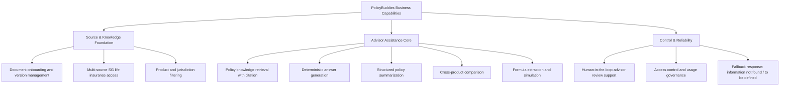

# PolicyBuddies Business Architecture

## Document Control
- Product: Project Buddies (PolicyBuddies)
- Purpose: Confirm business direction before implementation
- Status: Draft for alignment
- Last updated: 2026-02-21

## 1. Business Architecture

### 1.1 Vision
PolicyBuddies is an assistant-in-a-box for financial advisors that turns insurer-provided life insurance policy documents into fast, explainable answers and structured summaries.

### 1.2 Business Problem
- Advisors spend significant time searching policy wording and comparing product conditions.
- Advisors struggle to explain policy illustrations (projected values/scenarios) in a clear, compliant way.
- Advisors struggle to break down fees and charges (insurance charges, admin fees, fund-related costs) into client-friendly explanations.
- Manual interpretation increases inconsistency across advisors and teams.
- Slow response times reduce customer confidence and advisor productivity.
- Compliance risk rises when advice is based on memory rather than source-backed evidence.

### 1.3 Value Proposition
- Faster policy lookup with source-grounded Q&A.
- Consistent summary outputs across products and versions.
- Clear evidence traceability for advisor confidence and internal quality checks.
- Reusable product intelligence across advisory workflows.

### 1.4 Target Outcomes (12-month)
- Reduce time-to-answer for policy questions by 50%.
- Increase first-pass answer confidence for advisors.
- Improve consistency of policy summary quality across teams.
- Reduce unsupported policy claims in advisor explanations.

### 1.5 Business Capabilities
- Document onboarding and version management.
- Multi-source information access for Singapore life insurance products (insurer docs, product pages, brochures, benefit illustrations, and fee schedules).
- Policy knowledge retrieval with citation.
- Deterministic answer generation with stable prompts/rules for repeatable outputs.
- Structured policy summarization.
- Formula intelligence extraction and simulation-ready normalization.
- Product and jurisdiction filtering.
- Cross-product comparison (benefits, exclusions, fees, charges, and illustration assumptions).
- Human-in-the-loop advisor review support.
- Access control and usage governance.

### 1.5.1 High-Level Business Capabilities Model

Render as picture (PNG/SVG):
- Source file: `docs/architecture/policybuddies-business-capabilities.mmd`
- PNG: `npm run diagram:business:png`
- SVG: `npm run diagram:business:svg`
- Output files:
  - `docs/architecture/policybuddies-business-capabilities.png`
  - `docs/architecture/policybuddies-business-capabilities.svg`

### 1.6 Core Value Streams
1. Policy onboarding: upload or ingest policy content and classify by product/version/jurisdiction.
2. Advisory support: advisor asks policy questions and receives evidence-based responses.
3. Summary preparation: advisor generates structured policy briefs for internal use.
4. Continuous quality improvement: advisor feedback is used to improve answer quality and usability.
5. Simulation support: advisor runs policy value/benefit/charge simulation from parsed formula chunks.

### 1.7 Operating Model (Initial)
- Advisory users consume Q&A and summaries in daily client workflows.
- A small engineering implementation team maintains ingestion, retrieval quality, and provider reliability based on advisor feedback.
- Formula parser quality is version-controlled so simulations can be traced to exact source wording and formula chunk versions.

### 1.8 Formula Intelligence and Simulation Model
Business intent: convert policy formula wording into a simulation-ready chunk model, while preserving traceability to source lines.

Formula categories to support (MVP):
1. Death benefit formulas.
2. Bonus formulas (initial, performance investment, loyalty, power-up).
3. Charge formulas (monthly protection charge, premium shortfall charge, premium/top-up charge).
4. Surrender and withdrawal charge formulas.
5. Higher-of / lower-of decision formulas.
6. Sum-at-risk formulas.

Common life insurance formula types (business reference):

| Formula Type | Typical Business Use | Example Pattern |
| --- | --- | --- |
| Death Benefit Calculation | Determine payout on death event | `max(101% * AccountValue, NetPremium) + TopUpValue - Indebtedness` |
| Sum at Risk | Determine insurance risk exposure and protection charge basis | `max(NetPremium - 101% * AccountValue, 0)` |
| Surrender Value | Determine amount payable on policy surrender | `PolicyValue - SurrenderCharge - Indebtedness` |
| Surrender Charge | Apply penalty during lock-in/minimum investment period | `InitialUnitsValue * SurrenderChargeRate(policyYear)` |
| Partial Withdrawal Charge | Calculate cost for partial withdrawal transaction | `WithdrawalAmount * WithdrawalChargeRate` |
| Premium Shortfall Charge | Charge when premium unpaid/reduced | `(OP/12) * SC` or `((OP-NP)/12) * SC` |
| Monthly Protection Charge (MPC) | Monthly mortality/protection deduction | `SumAtRisk * MPCRate(age, gender, policyYear)` |
| Premium Allocation / Units Purchase | Convert premium into units after charge | `(Premium - PremiumCharge) / UnitPrice` |
| Fund Management Charge | Ongoing investment management deduction | `FundValue * FMC / 12` |
| Policy Value Projection | Project future value under assumed return | `PrevValue * (1+r) + NetPremiumAllocated - Charges` |
| Bonus Allocation (Initial/Loyalty/Power-up/Performance) | Credit additional units/benefits | `BonusRate * EligibleAccountValue` |
| Higher-Of / Lower-Of Rule | Enforce contract logic threshold | `max(FormulaA, FormulaB)` / `min(FormulaA, FormulaB)` |
| Waiver/Payer Benefit Trigger | Stop future premium on covered events | `If TriggerEvent=true => FuturePremium=0` |
| Rider Benefit Payout | Additional rider-specific payout logic | `RiderSumAssured * RiderTriggerFactor` |
| Benefit Cap / Limit Application | Enforce policy caps and contractual limits | `min(CalculatedBenefit, PolicyCap)` |
| Currency Conversion | Convert amounts across policy/fund currency | `AmountFCY * FXRate(t)` |
| Tax / Levy Adjustment (if applicable) | Apply statutory deductions/additions | `GrossBenefit - Tax - Levy` |

Simulation-ready chunk model (business-level):
1. `formulaChunkId`
2. `documentVersionId`
3. `formulaCategory`
4. `formulaName`
5. `expression` (normalized expression)
6. `variables` (e.g. `AccountValue`, `NetPremium`, `SC`, `OP`, `NP`)
7. `conditions` (e.g. "during minimum investment period")
8. `decisionType` (`single`, `higher_of`, `lower_of`)
9. `currencyContext`
10. `sourceCitation` (file + line range)
11. `effectiveVersion` (product/version/jurisdiction)
12. `parserConfidence`

Simulation flow (business):
1. Ingest and detect formula statements from source documents.
2. Normalize formula text into structured formula chunks.
3. Validate formula chunks with confidence review and source citation.
4. Store formula chunks in versioned registry.
5. Run simulation engine with advisor input assumptions.
6. Return simulated output with full evidence and formula trace.

Governance rule:
- If parser confidence is low or formula variables are incomplete, system must return `to be defined` for simulation output and request human review.

### 1.9 Scope Boundaries
In scope:
- Product coverage: all kinds of life insurance products.
- Singapore market focus with access to all relevant insurer-provided life insurance information sources.
- Policy document ingestion (text/markdown), chunking, retrieval, Q&A, and summarization.
- Formula chunk extraction and simulation-ready normalization from product documents.
- Simulation output with formula traceability and citation.
- Product metadata tagging and jurisdiction filters.
- Side-by-side product comparison outputs for advisor analysis.
- Source citation in outputs.
- Strict fallback behavior: if source evidence is unavailable, respond with `information not found` or `to be defined`.

Out of scope (initial release):
- Direct customer-facing autonomous advice.
- End-to-end policy sales workflow automation.
- Regulatory decision automation without human sign-off.
- Full actuarial pricing engine replacement.

### 1.10 Business KPIs
- Median question response latency.
- Citation coverage rate in answers.
- Advisor adoption (weekly active advisors).
- Summary generation turnaround time.
- Unsupported-answer rate from advisor QA sampling.
- Formula parse success rate (valid structured formula chunks / detected formula statements).
- Simulation traceability coverage rate (simulated outputs with complete formula citations).

## 2. User Personas

### Persona A: Financial Advisor (Primary)
- Role: Frontline advisor supporting client policy decisions.
- Goals:
  - Answer policy questions quickly during pre-sales and servicing.
  - Compare product features and exclusions accurately.
  - Prepare client-ready explanations with confidence.
- Pain points:
  - Hard to navigate long policy documents under time pressure.
  - Product/version confusion across insurers and markets.
  - Fear of giving incomplete or unsupported explanations.
- What they need from PolicyBuddies:
  - Natural-language Q&A with exact citations.
  - Structured summaries by product and topic.
  - Fast filtering by jurisdiction, product name, and version.
- Success criteria:
  - Can resolve common policy questions in minutes, not hours.
  - Trusts output because evidence is visible and relevant.

## 3. Assumptions and Constraints
- Human review remains mandatory for client-facing interpretation.
- Initial domain focus is life insurance policy reading support across all life insurance product types.
- Quality depends on accurate source ingestion and metadata hygiene.
- Jurisdiction-specific language must be preserved in source context.
- Answers must be factual and grounded only in accessible sources; no unsupported inference.

## 4. Open Questions (For Alignment)
1. Which geography is the first production target (SG only vs multi-market)?
2. What advisor QA workflow is required before output reuse in client conversations?
3. Which KPI thresholds define pilot success and go-live readiness?
