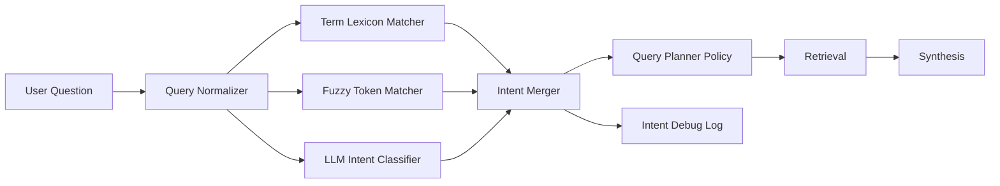

# PolicyBuddies Typo-Tolerant Intent Routing Scaffold

## Document Control
- Product: Project Buddies (PolicyBuddies)
- Purpose: Define typo-tolerant architecture for query intent and retrieval routing
- Status: Draft scaffold
- Last updated: 2026-02-21

## 1. Design Goals
- Improve intent detection robustness for misspellings and shorthand terms.
- Keep safety for insurance domain answers (no speculative routing).
- Preserve explainability via explicit debug output.
- Keep architecture modular and provider-agnostic.

## 2. Target Architecture

## 3. Core Components

### 3.1 Query Normalizer
- Input: raw user question.
- Output:
  - `originalQuestion`
  - `normalizedQuestion`
  - `appliedCorrections[]`
- Rules:
  - lowercase, trim, normalize whitespace.
  - correct high-frequency insurance typos only.
  - never auto-correct numeric values, percentages, dates, currency, policy years.

### 3.2 Insurance Lexicon
- Runtime file: `metadata/runtime/intent-lexicon.json`.
- Contains:
  - canonical term,
  - synonyms,
  - abbreviations,
  - common misspellings.
- Example domains:
  - rider/benefit/exclusion/claim/surrender/premium/critical illness.

### 3.3 Fuzzy Token Matcher
- Uses bounded edit distance for key insurance tokens.
- Recommended thresholds:
  - token length <= 5: max distance `1`
  - token length > 5: max distance `2`
- Emits matched canonical tokens and confidence contribution.

### 3.4 LLM Intent Classifier
- LLM-first intent classification remains active.
- Required output:
  - `intentClass`,
  - `confidence`,
  - optional `scopeHint`.
- LLM output is not trusted blindly; merged with deterministic signals.

### 3.5 Intent Merger
- Merge precedence:
  1. High-confidence lexicon/fuzzy critical hits (insurance safety terms),
  2. LLM intent class (if confidence >= threshold),
  3. deterministic fallback policy.
- Must preserve safety intent flags even when LLM misses them.
- Must emit final `intentRouting` and `queryPlan` debug payload.

## 4. Runtime Modes
- `hybrid_safe` (default):
  - LLM-first, deterministic safety overrides allowed.
- `llm_primary`:
  - LLM preferred; deterministic used only for invalid/low-confidence output.
- `deterministic`:
  - No LLM dependency for routing.

Runtime mode and confidence threshold should be configurable, but architecture documentation should remain implementation-agnostic and not bind to concrete key names.

## 5. Guardrails
- No silent correction for financially sensitive literals.
- If correction ambiguity is high, ask one clarifying question.
- If merged confidence is low, use conservative retrieval with broader scope and explicit uncertainty.
- All corrections and fuzzy matches must be visible in intent debug.

## 6. Observability Contract
- Ask debug output must include:
  - `originalQuestion`
  - `normalizedQuestion`
  - `appliedCorrections`
  - `fuzzyMatches`
  - `llmIntent` and confidence
  - `finalMergedIntent` and source
  - planner preferences (document priority, chunk priority, retrieval depth)

## 7. Rollout Plan
1. Add lexicon runtime file and loader.
2. Add normalizer and fuzzy matcher as pre-routing step.
3. Integrate merger in `questionService` routing assembly.
4. Extend intent debug output.
5. Run regression set:
   - typo variants (`criticall`, `surrendar`, `premiun`),
   - abbreviation variants (`CI`, `TPD`),
   - mixed intents.
